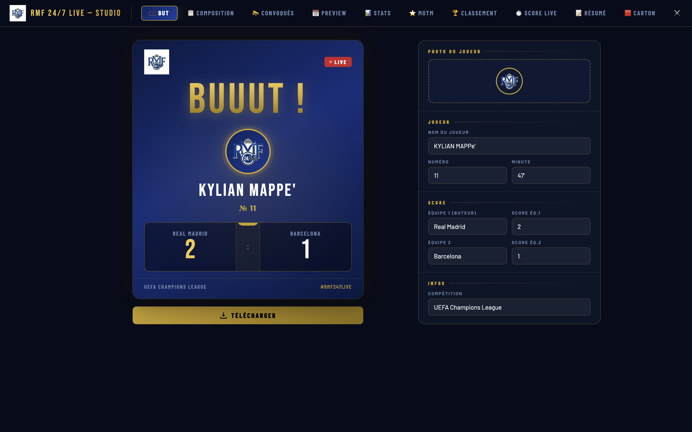
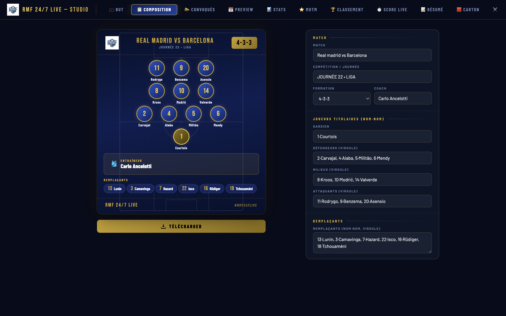
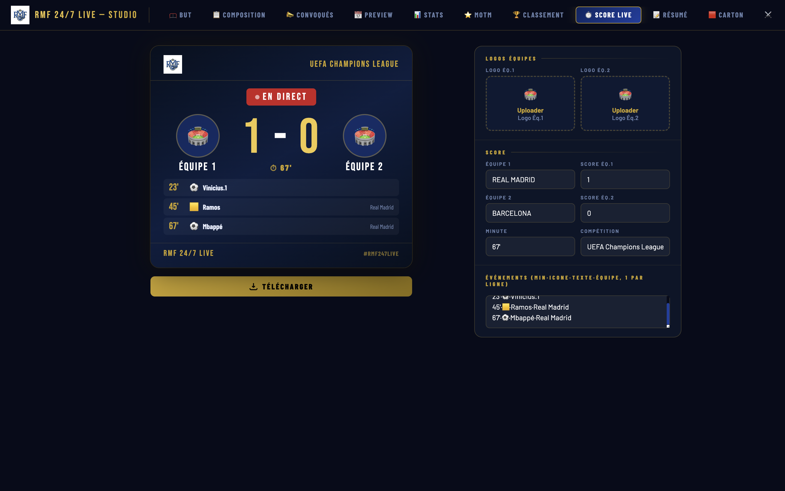
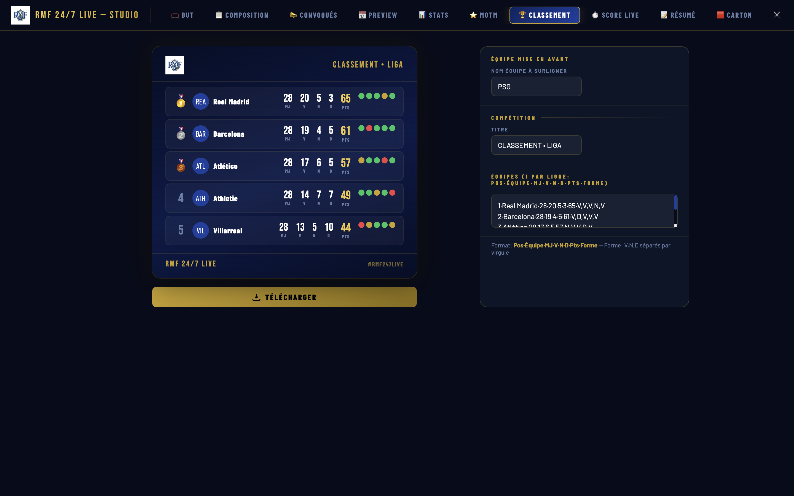
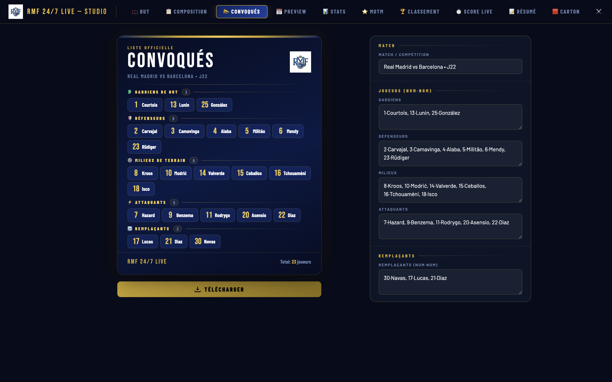

# RMFC LIVE — Studio v3.1

> **22 professional tools & templates.** Modify, personalize, add watermarks, and download in high-resolution PNG.

RMF 24/7 LIVE — Studio is a comprehensive graphic generation suite built for football fans and social media managers. Create stunning match-related content in seconds.

## 📸 Previews

  
  
  

  
  

## v3.1 New Features 🚀

- **Match Day Pro:** New full-bleed photo layout with customizable right-aligned overlay and dual club logos.
- **Enhanced Absentees:** Redesigned with background photo support, opacity controls, and flexible content positioning.
- **Data Mobility:** New **Export/Import** buttons in Settings to backup your local database or transfer it to another device.
- **Improved Watermarks:** Better rendering logic for background logos in official templates.

## ⚡ Quick Start

- **Live Modification:** Type in any field, and the card updates instantly.
- **Auto-Save:** All your data is automatically saved in your browser (LocalStorage).
- **High-Res Export:** Use the golden button under each card to download a 3x resolution PNG.
- **UI Customization:** Adjust overlays, blend modes, and positioning for photo-based templates.
- **Data Portability:** Download your configuration and images as a JSON file and restore them anytime.

## 📐 Universal Data Format

The Studio uses a standardized separator `·` (middle dot) for data entry.
_Alternatives: `|` or `:` on mobile._

| Module        | Format Example                 | Notes                             |
| :------------ | :----------------------------- | :-------------------------------- |
| **Players**   | `9·Benzema, 10·Modrić`         | Number · Name, separated by comma |
| **Events**    | `45'·⚽·Benzema·Eq.1`          | Minute · Icon · Player · Team     |
| **Standings** | `1·PSG·24·18·4·2·58·V,V,N,V,V` | Pos·Team·GP·W·D·L·Pts·Form        |
| **Watchlist** | `9·Benzema·FW·Real Madrid`     | Number · Name · Position · Team   |
| **Polls**     | `Benzema·42%`                  | Option · Percentage (1 per line)  |

## 🎨 The 22 Tools & Templates

1. Goal
2. Lineup
3. Squad List
4. Match Preview
5. Player Stats
6. Man of the Match
7. Standings
8. Live Score
9. Match Summary
10. Warnings
11. Head-to-Head
12. Absentees
13. Hat-trick
14. Record
15. Transfer
16. Poll
17. Forecast
18. Watermark
19. Generic
20. Calendrier
21. Citation
22. Comunicado

## 🛠️ Technical Stack

- **Frontend:** Vanilla HTML5 / CSS3 / JavaScript
- **Typography:** Google Fonts (Bebas Neue, Barlow, Playfair Display)
- **Rendering:** [html2canvas](https://html2canvas.hertzen.com/)
- **Storage:** Browser LocalStorage API (with JSON Export/Import)

---

_Created for RMF 24/7 LIVE._

## 📬 Contact

- **Email:** [guerthmanzala@gmail.com](mailto:guerthmanzala@gmail.com)
- **WhatsApp/Phone:** [+243977895644](tel:+243977895644)

## 📄 License

This project is licensed under the MIT License - see the [LICENSE](LICENSE) file for details.
